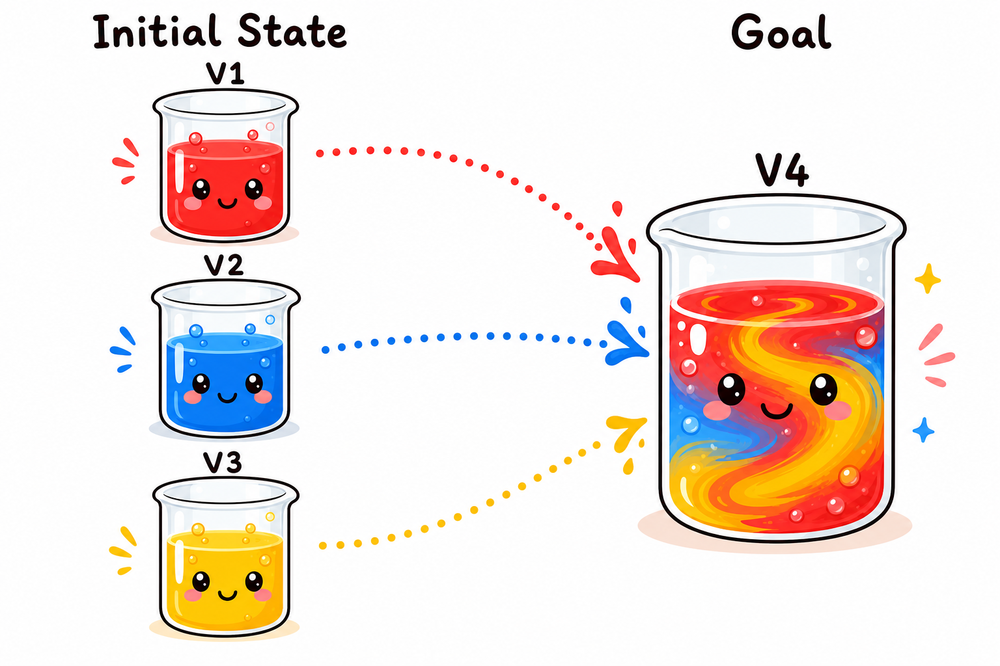

# LiquidWorld Problem Generator

A problem generator for **LiquidWorld** — a planning domain where an agent must pour liquids between vessels to achieve target mixtures. The generator creates solvable instances with configurable source/target complexity and built-in feasibility validation.

## Quick Start

### CLI Usage

```bash
python liquid_world_generator.py <config_file> [output_file]

# Examples
python liquid_world_generator.py config.json
python liquid_world_generator.py config.json data/output.json
```


## Config File Format

The config is a JSON file with a global `seed` and a `problems` list. All problems live in one flat list — the generator treats them uniformly:

```json
{
  "seed": 42,
  "problems": [
    {"id": 1, "source_components": [1,1,1], "components_per_target": [3]},
    {"id": 2, "source_components": [1,1,1,1], "components_per_target": [4]},
    {"id": 3, "source_components": [2,3,2], "components_per_target": [3]},
    {"id": 4, "source_components": [2,2,3], "components_per_target": [3,2]}
  ]
}
```

### Config Parameters

| Parameter | Type | Description |
|-----------|------|-------------|
| `source_components` | `list[int]` | Number of liquid types per source vessel. `1` = pure source, `≥2` = mixture. |
| `components_per_target` | `list[int]` | Number of liquid types per target vessel. Length = number of targets. |
| `source_volume` | `list[float]` (optional) | Volume per source vessel. Defaults to 10L each. |
| `target_volume` | `list[float]` (optional) | Volume per target vessel. Defaults to random 2–5L each. |
| `max_attempts` | `int` (optional) | Retry count for mixture modes that may fail solvability. Defaults to 50. |

The two key parameters that control problem complexity:
- **`source_components`** — controls source purity. All `1`s = pure sources (single liquid each); values `≥ 2` = mixture sources (multiple liquids pre-mixed).
- **`components_per_target`** — controls target count and complexity. Length = number of targets; each value = how many liquids that target requires.


## Validator

Every generated problem passes through `_validate_solvability()`, which performs three checks:

### Check 1: Volume Feasibility

Verifies that the total available volume of each liquid across all sources is at least as much as required across all targets.

```
For each liquid L:
    sum(source volumes of L) >= sum(target volumes of L)
```

### Check 2: Concentration Feasibility

Verifies that no target requires a liquid at a higher concentration than the maximum concentration of that liquid in any single source. This is a physical constraint — pouring preserves ratios, so you can never concentrate a liquid above its highest source concentration.

```
For each target T, for each liquid L in T:
    goal_concentration(L in T) <= max_source_concentration(L)
```

### Check 3: LP Feasibility

Solves a linear program to verify that non-negative pour volumes exist to achieve the exact goal compositions.

**Single-target LP**: for one target, each variable `x_i` represents the volume poured from source `i`. The LP checks:

```
minimize    sum(x_i)
subject to  A_eq · x = b_eq       (exact liquid volumes in target)
            0 <= x_i <= total_i    (non-negative, bounded by source volume)
```

where `A_eq[k][i] = concentration of liquid k in source i`, and `b_eq[k] = required volume of liquid k in target`.

**Joint multi-target LP** (`_check_joint_lp_feasibility`): for multiple targets sharing sources, the LP uses variables `x_{ij}` (volume from source `i` to target `j`) with additional capacity constraints:

```
minimize    sum(x_{ij})
subject to  For each (target j, liquid k):
                sum_i x_{ij} * conc_{ik} = goal_{jk}
            For each source i:
                sum_j x_{ij} <= source_total_i
            x_{ij} >= 0
```

This joint formulation accounts for source volume being shared across targets, catching cases where each target is individually feasible but the sources don't have enough total volume to satisfy all targets simultaneously.

> **Dependency**: LP checks require `scipy` (`scipy.optimize.linprog` with the HiGHS solver).

## Output Format

Each generated problem is a JSON object:

```json
{
  "id": 1,
  "initial_state_str": "V1 (capacity 999L): 10 L L1; V2 (capacity 999L): 10 L L2; V3 (capacity 999L): 10 L L3; V4 (capacity 999L): empty",
  "goal_state_str": "V4: 3 L, 15.0% L1, 40.0% L2, 45.0% L3",
  "containers": {
    "V1": {"L1": 10.0},
    "V2": {"L2": 10.0},
    "V3": {"L3": 10.0},
    "V4": {}
  },
  "capacities": {"V1": 999.0, "V2": 999.0, "V3": 999.0, "V4": 999.0},
  "goal_containers": {
    "V4": {"L1": 0.45, "L2": 1.2, "L3": 1.35}
  },
  "n_liquids": 3,
  "n_sources": 3,
  "n_targets": 1
}
```

| Field | Description |
|-------|-------------|
| `initial_state_str` | Human-readable initial state (LLM input) |
| `goal_state_str` | Human-readable goal state (LLM input) |
| `containers` | Structured initial vessel contents (liquid → volume) |
| `goal_containers` | Structured goal vessel contents |
| `capacities` | Vessel capacities (all `999.0` = unlimited) |
| `n_liquids` | Total distinct liquid types in the problem |
| `n_sources` / `n_targets` | Source and target vessel counts |

## LLM Input Example

The LLM sees `initial_state_str` and `goal_state_str` as the problem to solve:

```
Initial state: V1 (capacity 999L): 10 L L1; V2 (capacity 999L): 10 L L2; V3 (capacity 999L): 10 L L3; V4 (capacity 999L): empty
Goal: V4: 3 L, 15.0% L1, 40.0% L2, 45.0% L3
```

Expected output:

```
Pour 0.45 L from V1 to V4
Pour 1.2 L from V2 to V4
Pour 1.35 L from V3 to V4
```



